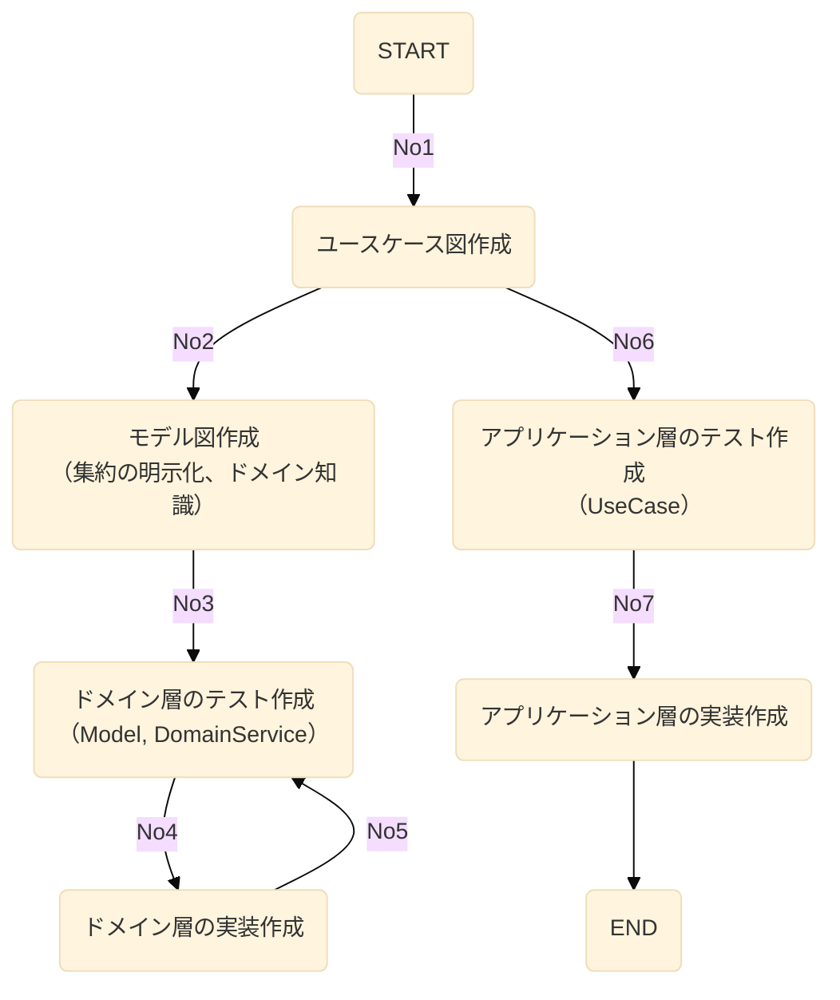
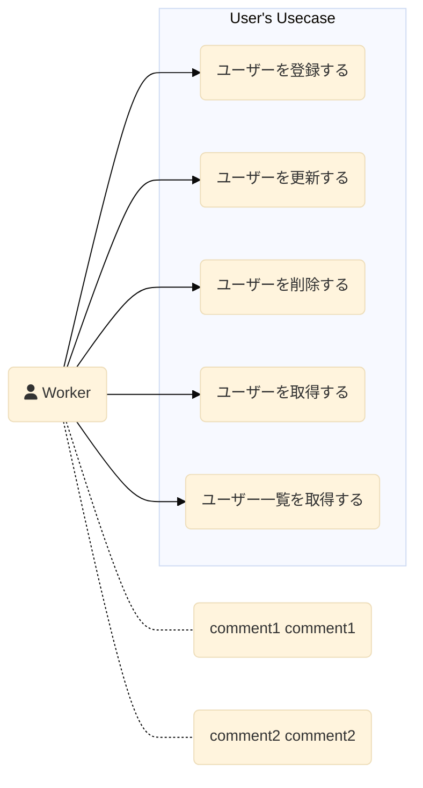
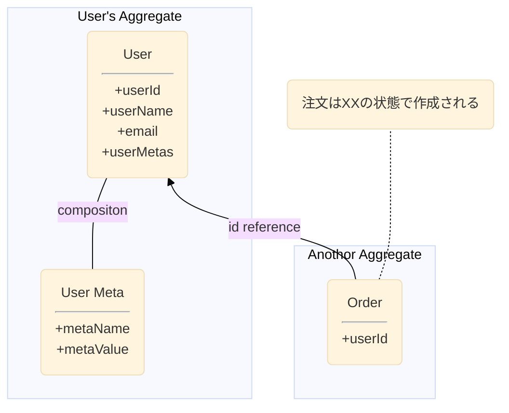
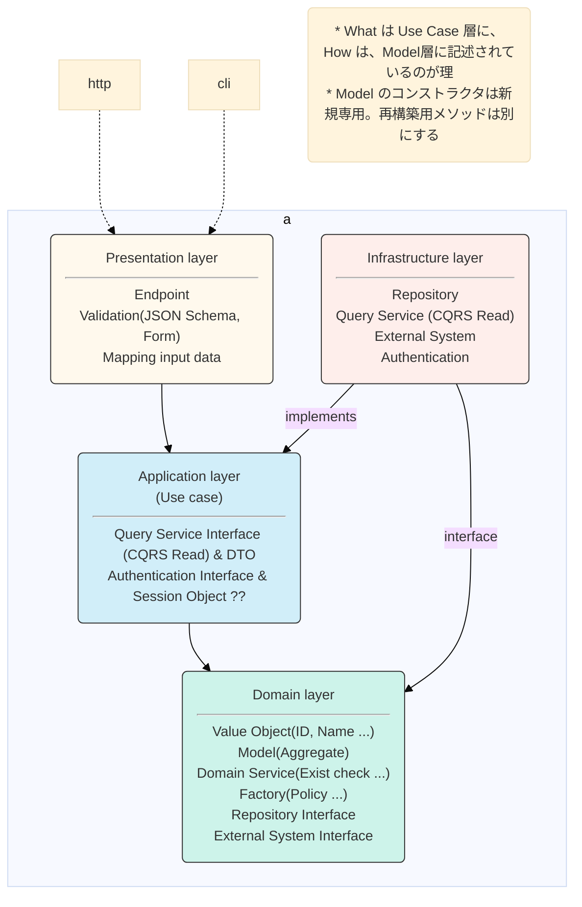

# My Architecture Guide

## Development flow



## Diagram

### Use Case

「○○を△△する」形式で記載する  



### Model

集約を明確にする。集約内は同一トランザクションで処理を行うので    
階層を深くしたり、集約内のモデルを増やさない  



## Layer



### 値オブジェクト

```text
以下に該当しない場合は、プリミティブ型（int,string,bool）にする
・ルールが存在しているか  
・その値を単体で扱いたいか

なお、識別子は値オブジェクトにした方が良い。  
```

例：  
* `AppCore\Domain\User\UserId`  
* `AppCore\Domain\User\UserName`

### ドメインモデル

例：  
* `AppCore\Domain\User\User`

### リポジトリ

```text
ドメインモデルの永続化・検索を行う。集約内は全て処理する。
```

例：  
* `AppCore\Domain\User\UserRepositoryInterface`  
* `AppCore\Infrastructure\Persistence\RDB\UserRepository`

### ドメインサービス

```text
モデルや値オブジェクトに定義した場合に、不自然さがある場合にドメインサービスを利用する。
主に、集合に対するルールや制約を定義する。例えば、重複チェック。
```

例：  
* `AppCore\Domain\User\UserDomainService`  

### クエリーサービス（クエリモデル）

```text
集約を跨いだモデルを取得したい場合に利用する。戻り値は専用の参照系モデル（DTO等）。
参照系モデルは、値オブジェクトを含まないプリミティブな型で構成する。
```

例：  
* `AppCore\Application\User\UserQueryServiceInterface`  
* `AppCore\Application\User\UserXxxDto`  
* `AppCore\Infrastructure\Service\UserQueryService`

### システム外部との入出力（例：メール送信）

```text
内部の層(ドメイン層、ユースケース層)にインターフェイスを定義し、インフラ層に実装クラスを置く。
```

例：  
* `AppCore\Application\Shared\AuthenticationInterface`  
* `AppCore\Infrastructure\Shared\Authentication`  
* `AppCore\Domain\PushNotification\PushNotificationSenderInterface`  
* `AppCore\Domain\PushNotification\PushMessage`  
* `AppCore\Infrastructure\Shared\PushNotificationSender`  
* `AppCore\Domain\Email\EmailSenderInterface`  
* `AppCore\Domain\Email\Email`  
* `AppCore\Infrastructure\Shared\EmailSender`  

### ユースケース

```text
インプットデータに基づいた条件で、実行しアウトプットデータの形式で返却する。
実行には、リポジトリ・ドメインサービス・クエリーサービスを利用する。
```

例：  
* `AppCore\Application\User\Create\UserCreateInputData`  
* `AppCore\Application\User\Create\UserCreateOutputData`  
* `AppCore\Application\User\UserCreateUseCase`

### ビューモデル

```text
表示系モデル。値オブジェクトを含まないプリミティブな型で構成する。
```

例：  
* `AppCore\InterfaceAdapter\Presenter\User\UserGetViewModel`

### コントローラ

```text
クライアントからのリクエストを元に、ユースケースを実行する。
取得したデータは、表示系モデルに入れてビューに渡す
```

## Reference

* Onion Architecture  
https://jeffreypalermo.com/2008/07/the-onion-architecture-part-1/  

* ITDDD  
https://github.com/nrslib/itddd

* CQRS実践入門  
https://little-hands.hatenablog.com/entry/2019/12/02/cqrs

* DDDのモデリングとは何なのか、 そしてどうコードに落とすのか  
https://www.slideshare.net/koichiromatsuoka/domain-modeling-andcoding

* PlantUML  
https://plantuml.com/ja/class-diagram
